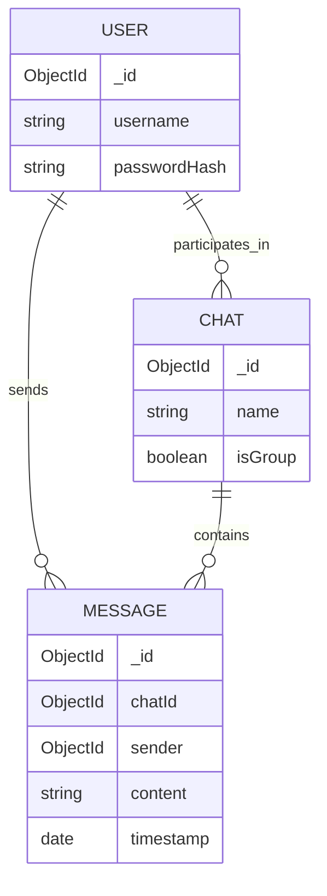

# Data Model

```mermaid
erDiagram
    USER {
        ObjectId _id
        string username
        string passwordHash
    }

    CHAT {
        ObjectId _id
        string name
        boolean isGroup
    }

    MESSAGE {
        ObjectId _id
        ObjectId chatId
        ObjectId sender
        string content
        date timestamp
    }

    USER ||--o{ MESSAGE : sends
    USER ||--o{ CHAT : participates_in
    CHAT ||--o{ MESSAGE : contains
```